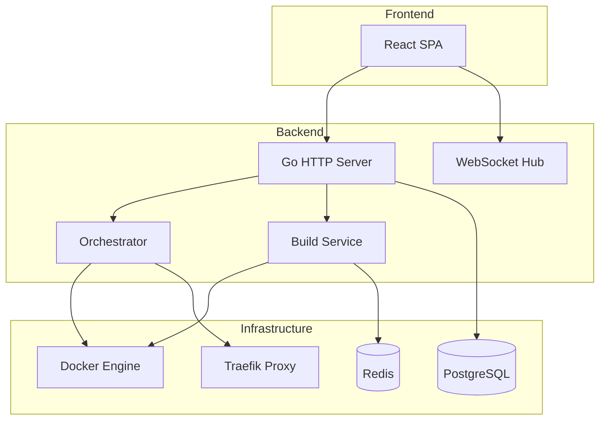
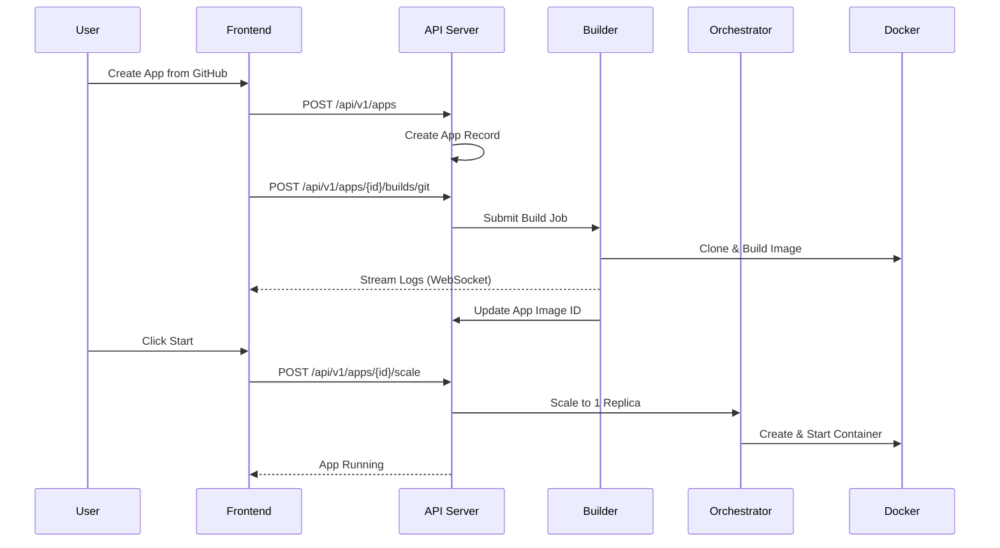
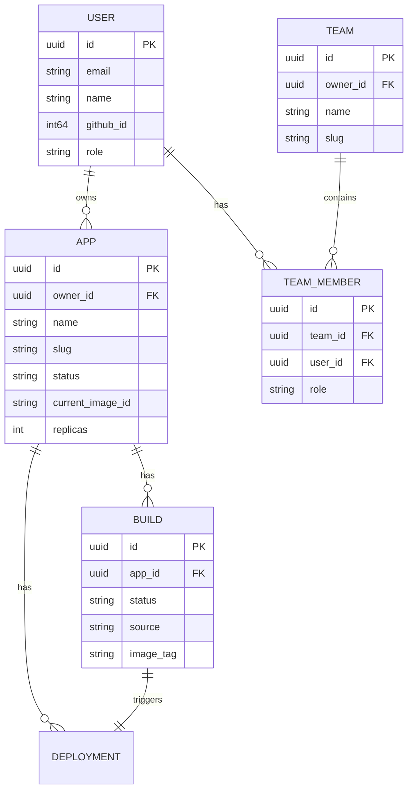
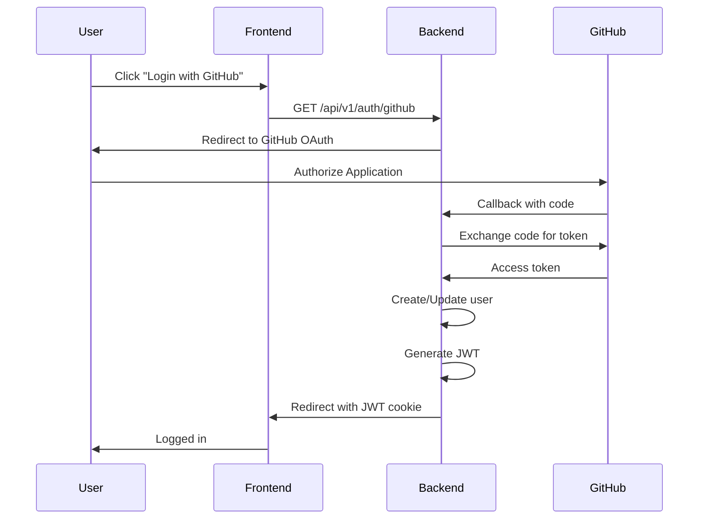
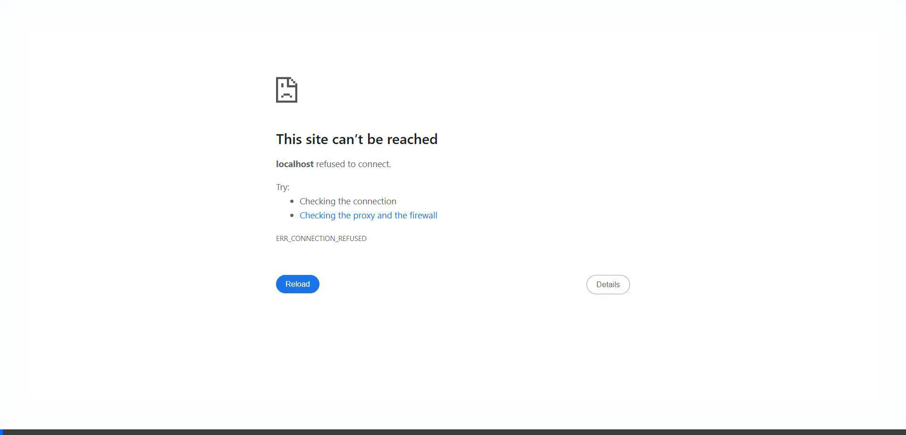

<p align="center">
  <h1 align="center">🚀 NanoPaaS</h1>
  <p align="center">
    <strong>A lightweight, self-hosted Platform-as-a-Service built with Go and React</strong>
  </p>
  <p align="center">
    Deploy your applications with a single click • GitHub integration • Real-time monitoring
  </p>
</p>

---

## 📋 Table of Contents

- [Overview](#-overview)
- [Features](#-features)
- [Architecture](#-architecture)
- [Tech Stack](#-tech-stack)
- [Domain Models](#-domain-models)
- [API Reference](#-api-reference)
- [Security](#-security)
- [Getting Started](#-getting-started)
- [Configuration](#-configuration)
- [Screenshots](#-screenshots)

---

## 🌟 Overview

NanoPaaS is a production-ready, self-hosted Platform-as-a-Service that enables developers to deploy containerized applications with ease. It provides a Heroku-like experience on your own infrastructure.

### Key Highlights

| Feature | Description |
|---------|-------------|
| **One-Click Deploy** | Deploy directly from GitHub repositories |
| **Auto-Scaling** | Scale from 0 to 10 replicas with a single API call |
| **Real-Time Logs** | WebSocket-based log streaming |
| **GitHub OAuth** | Secure authentication with GitHub |
| **Container Orchestration** | Docker-based container management |
| **Reverse Proxy** | Automatic Traefik routing configuration |

---

## ✨ Features

### Application Management
- ✅ Create, deploy, start, stop, and delete applications
- ✅ Environment variable management
- ✅ Resource limits (Memory, CPU)
- ✅ Custom subdomain routing

### Build System
- ✅ Git-based builds from GitHub repositories
- ✅ Dockerfile detection and building
- ✅ Real-time build log streaming
- ✅ Build queue with worker pool

### Scaling & Orchestration
- ✅ Horizontal scaling (0-10 replicas)
- ✅ Automatic container cleanup
- ✅ Health monitoring
- ✅ Graceful shutdown

### Security
- ✅ GitHub OAuth 2.0 authentication
- ✅ JWT token-based sessions
- ✅ CORS protection
- ✅ Webhook signature verification

---

## 🏗 Architecture

### System Overview



### Request Flow



### Component Architecture

```
┌─────────────────────────────────────────────────────────────────┐
│                         Frontend (React)                        │
│  ┌──────────┐ ┌──────────┐ ┌──────────┐ ┌──────────────────┐   │
│  │Dashboard │ │ App List │ │App Detail│ │  Build Logs WS   │   │
│  └──────────┘ └──────────┘ └──────────┘ └──────────────────┘   │
└─────────────────────────────────────────────────────────────────┘
                              │
                              ▼
┌─────────────────────────────────────────────────────────────────┐
│                    Backend Services (Go)                        │
│  ┌──────────────────────────────────────────────────────────┐   │
│  │                    HTTP Router (Chi)                      │   │
│  │  /api/v1/apps  /api/v1/auth  /ws/apps/{id}/logs          │   │
│  └──────────────────────────────────────────────────────────┘   │
│                              │                                   │
│  ┌────────────┐ ┌────────────┐ ┌────────────┐ ┌────────────┐   │
│  │   Auth     │ │    App     │ │   Build    │ │    Log     │   │
│  │  Handler   │ │  Handler   │ │  Handler   │ │  Handler   │   │
│  └────────────┘ └────────────┘ └────────────┘ └────────────┘   │
│         │              │              │              │          │
│  ┌──────────────────────────────────────────────────────────┐   │
│  │              Core Services Layer                          │   │
│  │  ┌──────────┐ ┌──────────┐ ┌──────────┐ ┌──────────┐     │   │
│  │  │  Auth    │ │Orchestrat│ │  Builder │ │  Router  │     │   │
│  │  │ Service  │ │   or     │ │ Service  │ │ (Traefik)│     │   │
│  │  └──────────┘ └──────────┘ └──────────┘ └──────────┘     │   │
│  └──────────────────────────────────────────────────────────┘   │
│                              │                                   │
│  ┌──────────────────────────────────────────────────────────┐   │
│  │              Infrastructure Layer                         │   │
│  │  ┌──────────┐ ┌──────────┐ ┌──────────┐                  │   │
│  │  │  Docker  │ │PostgreSQL│ │  Redis   │                  │   │
│  │  │  Client  │ │   Pool   │ │  Client  │                  │   │
│  │  └──────────┘ └──────────┘ └──────────┘                  │   │
│  └──────────────────────────────────────────────────────────┘   │
└─────────────────────────────────────────────────────────────────┘
```

---

## 🛠 Tech Stack

### Backend
| Technology | Purpose |
|------------|---------|
| **Go 1.21+** | Core backend language |
| **Chi Router** | HTTP routing and middleware |
| **Docker SDK** | Container management |
| **PostgreSQL** | Persistent data storage |
| **Redis** | Caching and build logs |
| **Zap** | Structured logging |
| **JWT** | Authentication tokens |

### Frontend
| Technology | Purpose |
|------------|---------|
| **React 18** | UI framework |
| **TypeScript** | Type-safe JavaScript |
| **Vite** | Build tool |
| **TanStack Query** | Data fetching and caching |
| **React Router** | Client-side routing |

### Infrastructure
| Technology | Purpose |
|------------|---------|
| **Docker** | Container runtime |
| **Docker Compose** | Multi-container orchestration |
| **Traefik** | Reverse proxy and load balancer |

---

## 📊 Domain Models

### Application Entity

```go
type App struct {
    ID              uuid.UUID         // Unique identifier
    Name            string            // Display name
    Slug            string            // URL-safe identifier
    Status          AppStatus         // created|building|running|stopped|failed
    EnvVars         map[string]string // Environment variables
    
    // Docker
    CurrentImageID  string            // Active Docker image
    Replicas        int               // Current running replicas
    TargetReplicas  int               // Desired replica count
    
    // Resources
    MemoryLimit     int64             // Memory limit in bytes
    CPUQuota        int64             // CPU quota in microseconds
    
    // Routing
    Subdomain       string            // App subdomain
    ExposedPort     int               // Container port
    
    // Git Integration
    GitRepoURL      string            // Repository URL
    GitBranch       string            // Branch to deploy
    AutoDeploy      bool              // Auto-deploy on push
    
    // Metadata
    OwnerID         uuid.UUID         // Owner user ID
    CreatedAt       time.Time
    UpdatedAt       time.Time
}
```

### User Entity

```go
type User struct {
    ID            uuid.UUID   // Unique identifier
    Email         string      // User email
    Name          string      // Display name
    GitHubID      int64       // GitHub user ID
    GitHubLogin   string      // GitHub username
    GitHubToken   string      // OAuth access token (encrypted)
    Role          UserRole    // admin|member|viewer
    CreatedAt     time.Time
    LastLoginAt   *time.Time
}
```

### Build Entity

```go
type Build struct {
    ID             uuid.UUID    // Unique identifier
    AppID          uuid.UUID    // Parent application
    Status         BuildStatus  // queued|running|succeeded|failed
    Source         BuildSource  // git|gzip|url
    SourceURL      string       // Repository or archive URL
    GitRef         string       // Branch/tag/commit
    DockerfilePath string       // Path to Dockerfile
    ImageTag       string       // Built image tag
    ImageID        string       // Docker image ID
    CreatedAt      time.Time
    CompletedAt    *time.Time
    ErrorMessage   string       // Error details if failed
}
```

### Entity Relationships



---

## 📡 API Reference

### Authentication

| Endpoint | Method | Description |
|----------|--------|-------------|
| `/api/v1/auth/github` | GET | Initiate GitHub OAuth flow |
| `/api/v1/auth/github/callback` | GET | OAuth callback handler |
| `/api/v1/auth/me` | GET | Get current user |
| `/api/v1/auth/logout` | POST | Invalidate session |

### Applications

| Endpoint | Method | Description |
|----------|--------|-------------|
| `/api/v1/apps` | GET | List all applications |
| `/api/v1/apps` | POST | Create new application |
| `/api/v1/apps/{id}` | GET | Get application details |
| `/api/v1/apps/{id}` | PUT | Update application |
| `/api/v1/apps/{id}` | DELETE | Delete application |
| `/api/v1/apps/{id}/scale` | POST | Scale application |
| `/api/v1/apps/{id}/restart` | POST | Restart application |
| `/api/v1/apps/{id}/stop` | POST | Stop application |
| `/api/v1/apps/{id}/env` | PUT | Set environment variables |

### Builds

| Endpoint | Method | Description |
|----------|--------|-------------|
| `/api/v1/apps/{id}/builds/git` | POST | Start build from Git |
| `/api/v1/apps/{id}/builds/{buildId}` | GET | Get build status |
| `/api/v1/apps/{id}/builds/{buildId}/cancel` | POST | Cancel build |

### WebSocket

| Endpoint | Description |
|----------|-------------|
| `/ws/apps/{id}/logs` | Real-time application logs |
| `/ws/builds/{id}/logs` | Real-time build logs |

---

## 🔒 Security

### Authentication Flow



### Security Features

| Feature | Implementation |
|---------|----------------|
| **Authentication** | GitHub OAuth 2.0 + JWT |
| **Session Management** | HTTP-only secure cookies |
| **API Protection** | Bearer token middleware |
| **CORS** | Configurable allowed origins |
| **Webhook Security** | HMAC-SHA256 signature verification |
| **Token Storage** | Encrypted at rest |
| **Container Isolation** | Docker network segmentation |

### Role-Based Access Control

| Role | Permissions |
|------|-------------|
| **Admin** | Full system access |
| **Member** | Manage own apps, view team apps |
| **Viewer** | Read-only access |

---

## 🚀 Getting Started

### Prerequisites

- Docker & Docker Compose
- Go 1.21+ (for development)
- Node.js 18+ (for frontend development)
- GitHub OAuth Application

### Quick Start

1. **Clone the repository**
```bash
git clone https://github.com/Yashraj-Pradip-Haridas/NanoPaas.git
cd NanoPaas
```

2. **Configure environment**
```bash
cp .env.example .env
# Edit .env with your GitHub OAuth credentials
```

3. **Start the platform**
```bash
docker-compose up -d
```

4. **Access the dashboard**
```
http://localhost:3000
```

### Development Setup

```bash
# Backend
go mod download
go run cmd/nanopaas/main.go

# Frontend
cd frontend
npm install
npm run dev
```

---

## ⚙️ Configuration

### Environment Variables

| Variable | Description | Default |
|----------|-------------|---------|
| `SERVER_HOST` | API server host | `0.0.0.0` |
| `SERVER_PORT` | API server port | `8080` |
| `POSTGRES_HOST` | PostgreSQL host | `postgres` |
| `POSTGRES_PORT` | PostgreSQL port | `5432` |
| `POSTGRES_DB` | Database name | `nanopaas` |
| `REDIS_HOST` | Redis host | `redis` |
| `REDIS_PORT` | Redis port | `6379` |
| `GITHUB_CLIENT_ID` | OAuth client ID | Required |
| `GITHUB_CLIENT_SECRET` | OAuth client secret | Required |
| `JWT_SECRET` | JWT signing key | Required |

### Docker Compose Services

| Service | Port | Description |
|---------|------|-------------|
| `nanopaas` | 8080 | Main API server |
| `postgres` | 5432 | PostgreSQL database |
| `redis` | 6379 | Redis cache |
| `traefik` | 80, 443 | Reverse proxy |

---

## 📸 Screenshots

### Full Deployment Verification

*Complete app creation, build, and scaling workflow*

### Deployment Flow

*Successful application deployment with container creation*

### Frontend Interface

*NanoPaaS dashboard and application management*

---

## 📝 License

MIT License - see [LICENSE](LICENSE) for details.

---

## 🤝 Contributing

Contributions are welcome! Please read [CONTRIBUTING.md](CONTRIBUTING.md) for guidelines.

---

<p align="center">
  Made with ❤️ using Go and React
</p>
